# ROS入门

-------
## ROS Tools

| 常用指令                                        | 说明                                             |
| :-------------------------------------------- | :---------------------------------------------- |
| rosnode list                                   | 查看所有激活的节点                                  |
| rostopic list                                  | 查看所有激活的topic                                |
| rostopic info <topic name>	                     | 可以查看topic的调用信息类型，还有它的发布者以及订阅者     |
| rostopic echo <topic name>                     | 查看对应topic发布的消息                             |
| rqt_graph	                                      | 以图像的形式表现整个正在运行的ROS系统                  |
| rqt_plot velocity/data	                        | 以二维图的形式查看topic的输出                        |
| rosmsg show package/messageName                | 例如：rosmsg show std_msgs/Float64 查看对应的消息类型 |
| rosrun <packagename> <node name>               | 运行包中的节点（编译成功后才能运行）                   |
| roslaunch <package name> <launch file>          | 启动.launch文件                                   |
| catkin_make                                    | 进入到工作区间后，执行会编译所有的包                   |
| catkin_make -DCATKIN_WHITELIST_PACKAGES=package | 编译指定的包                                       |


## ROS 常用命令
|       命令        |          作用          |
| :--------------: | :-------------------: |
|      rospack      |      获取功能包信息      |
|      rosdep       | 自动安装功能包依赖的其他包 |
|       roscd       |      功能包目录跳转      |
|       rosed       |    编辑功能包中的文件    |
|      rosrun       |  运行功能包中的可执行文件  |
|     roslaunch     |      运行启动文件       |
|    catkin_make    |  编译工作空间中的功能包   |
|       roscp       |    拷贝功能包中的文件    |
| catkin_create_pkg |       创建功能包        |


-------

## ROS工作空间

[参考](https://blog.csdn.net/qq_16481211/article/details/81157725)

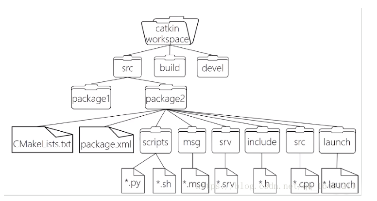

### catkin工作空间
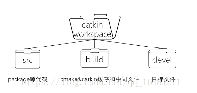

* 创建catkin空间

```
mkdir -p ./catkin_ws(your space name)/src
catkin_init_workspace ## 创建了camkeLists.txt文件
cd ./catkin_ws  # 进入工作空间root目录
catkin_make  # 编译空间
```

* `catkin_make `命令在**catkin**工作空间中是一个非常方便的工具。如果你查看一下当前目录应该能看到`build`和`devel`这两个文件夹。
build 目录是build space的默认所在位置，同时cmake 和 make也是在这里被调用来配置并编译你的程序包。devel 目录是devel space的默认所在位置, 同时也是在你安装程序包之前存放可执行文件和库文件的地方
*  在`devel`文件夹里面你可以看到几个setup.*sh文件。source这些文件中的任何一个都可以将当前工作空间设置在ROS工作环境的最顶层，想了解更多请参考catkin文档。接下来首先source一下新生成的setup.*sh文件：

``` l
source devel/setup.bash
```
将对应的工作空间的路径加入环境变量ROS_PACKAGE_PATH中。
如果新开了一个终端命令行，在使用该工作空间前，必须先将该工作空间的路径加入环境变量ROS_PACKAGE_PATH中

* 要想保证工作空间已配置正确需确保ROS_PACKAGE_PATH环境变量包含你的工作空间目录，采用以下命令查看：

```
echo $ROS_PACKAGE_PATH
/home/<youruser>/catkin_ws/src:/opt/ros/indigo/share:/opt/ros/indigo/stacks
```
or 

``` l
printenv | grep ROS

```

### 多个工作空间处理
[参考](https://blog.csdn.net/u013834525/article/details/88871318)

> * 删掉`build`和`devel`文件夹
> * 删掉`ROS_PACKAGE_PATH`环境变量：`unset ROS_PACKAGE_PATH`
> * 重新编译你的包
> * 注释掉`~/.bashrc`中无关的包的`bash`，只保留想要的工作空间
> * `source ~/.bashrc`

-----
## ros程序包(Meta Package)

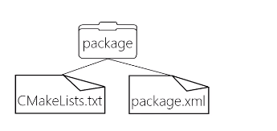
一个程序包要想称为catkin程序包必须符合以下要求：

* 该程序包必须包含`catkin compliant package.xml`文件

这个package.xml文件提供有关程序包的元信息。
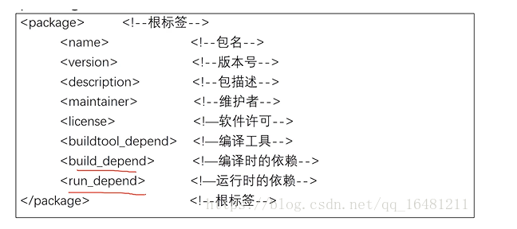


* 程序包必须包含一个catkin 版本的`CMakeLists.txt`文件，而`Catkin metapackages`中必须包含一个对CMakeList.txt文件的引用。

* `script`我们ROS里面的可执行程序包括：(1)脚本，如shell或者python；（2）C++头文件或者源文件
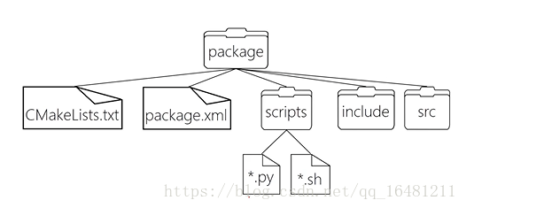

* 我们还会放一些自定义的通信格式：包括消息`msg`、服务`srv`、动作`action`
比如我们想在ROS下面自定义一个服务，那我们就在package下新建一个srv文件夹，然后在这个文件夹里放*.srv文件。
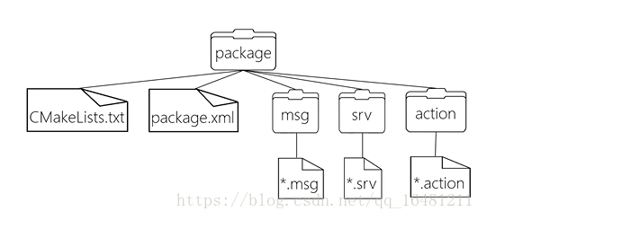

* 我们还可以在package下放`launch`文件和`config`文件
launch的作用就是用来一次性运行多个文件。一帮放在launch文件中
配置文件一般放到config文件夹下。它的自由度比较高，一般用.yaml格式来写
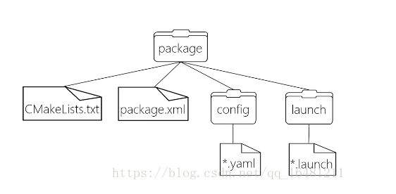


* 每个目录下只能有一个程序包。
这意味着在同一个目录下不能有嵌套的或者多个程序包存在。
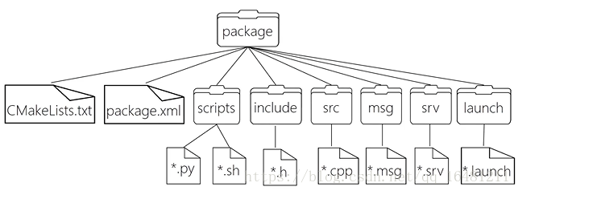

-------

### 创建catkin程序包
* 在catkin工作空间中的src目录下
现在使用catkin_create_pkg命令来创建一个名为'beginner_tutorials'的新程序包，这个程序包依赖于std_msgs、roscpp和rospy：

```
catkin_create_pkg <pkg_name> [depend1] [depend2]
```


```
 catkin_create_pkg beginner_tutorials std_msgs rospy roscpp
```

------


### 程序包查找
```
rospack find <pkg_name>
```


### 查看包的依赖关系
####  直接依赖
```
$ rospack depend1 beginnner_tutorials
```

```
std_msgs
rospy
roscpp
```
* rospack列出了在运行catkin_create_pkg命令时作为参数的依赖包，这些依赖包随后保存在`beginner_tutorials /package.xml`文件中。

```
<package>
...
  <buildtool_depend>catkin</buildtool_depend>
  <build_depend>roscpp</build_depend>
  <build_depend>rospy</build_depend>
  <build_depend>std_msgs</build_depend>
...
</package>
```
#### 间接依赖
* 在很多情况中，一个依赖包还会有它自己的依赖包，比如，rospy还有其它依赖包

------
### 自定义程序包
* 自定义`package.xml`

```
<?xml version="1.0"?>
<package format="2">
  <name>beginner_tutorials</name>
  <version>0.0.0</version>
  <description>The beginner_tutorials package</description>  ## 首先更新描述标签

### 维护者标签
  <!-- One maintainer tag required, multiple allowed, one person per tag -->
  <!-- Example:  -->
  <!-- <maintainer email="jane.doe@example.com">Jane Doe</maintainer> -->
  <maintainer email="bornchow@todo.todo">bornchow</maintainer>

### 许可标签
  <!-- One license tag required, multiple allowed, one license per tag -->
  <!-- Commonly used license strings: -->
  <!--   BSD, MIT, Boost Software License, GPLv2, GPLv3, LGPLv2.1, LGPLv3 -->
  <license>BSD</license>


  <!-- Url tags are optional, but multiple are allowed, one per tag -->
  <!-- Optional attribute type can be: website, bugtracker, or repository -->
  <!-- Example: -->
  <!-- <url type="website">http://wiki.ros.org/beginner_tutorials</url> -->


  <!-- Author tags are optional, multiple are allowed, one per tag -->
  <!-- Authors do not have to be maintainers, but could be -->
  <!-- Example: -->
  <!-- <author email="jane.doe@example.com">Jane Doe</author> -->

### 依赖项标签
### 接下来的标签用来描述程序包的各种依赖项，这些依赖项分为build_depend、buildtool_depend、run_depend、test_depend
  <!-- The *depend tags are used to specify dependencies -->
  <!-- Dependencies can be catkin packages or system dependencies -->
  <!-- Examples: -->
  <!-- Use depend as a shortcut for packages that are both build and exec dependencies -->
  <!--   <depend>roscpp</depend> -->
  <!--   Note that this is equivalent to the following: -->
  <!--   <build_depend>roscpp</build_depend> -->
  <!--   <exec_depend>roscpp</exec_depend> -->
  <!-- Use build_depend for packages you need at compile time: -->
  <!--   <build_depend>message_generation</build_depend> -->
  <!-- Use build_export_depend for packages you need in order to build against this package: -->
  <!--   <build_export_depend>message_generation</build_export_depend> -->
  <!-- Use buildtool_depend for build tool packages: -->
  <!--   <buildtool_depend>catkin</buildtool_depend> -->
  <!-- Use exec_depend for packages you need at runtime: -->
  <!--   <exec_depend>message_runtime</exec_depend> -->
  <!-- Use test_depend for packages you need only for testing: -->
  <!--   <test_depend>gtest</test_depend> -->
  <!-- Use doc_depend for packages you need only for building documentation: -->
  <!--   <doc_depend>doxygen</doc_depend> -->
  <buildtool_depend>catkin</buildtool_depend>
  <build_depend>roscpp</build_depend>
  <build_depend>rospy</build_depend>
  <build_depend>std_msgs</build_depend>
  <build_export_depend>roscpp</build_export_depend>
  <build_export_depend>rospy</build_export_depend>
  <build_export_depend>std_msgs</build_export_depend>
### run_depend
  <exec_depend>roscpp</exec_depend>
  <exec_depend>rospy</exec_depend>
  <exec_depend>std_msgs</exec_depend>


  <!-- The export tag contains other, unspecified, tags -->
  <export>
    <!-- Other tools can request additional information be placed here -->

  </export>
</package>
```
------
## 编译ros程序包
### 使用`catkin_make`
catkin_make 是一个命令行工具，它简化了catkin的标准工作流程。你可以认为catkin_make是在CMake标准工作流程中依次调用了cmake 和 make。
```
catkin_make [make-targets] [-DCMAKE-VARIABLES=...]
```
* 每个CMake工程在编译时都会执行这个操作过程。相反，多个catkin项目可以放在工作空间中一起编译，工作流程如下

```
# In a catkin workspace
$ catkin_make
$ catkin_make install  # (可选)
```
* 如果你的源代码不在默认工作空间中（~/catkin_ws/src),比如说存放在了my_src中，那么你可以这样来使用catkin_make:

```
# In a catkin workspace
$ catkin_make --source my_src
$ catkin_make install --source my_src  # (optionally)
```

------
## ROS节点


* Nodes:节点,一个节点即为一个可执行文件，它可以通过ROS与其它节点进行通信。
* Messages:消息，消息是一种ROS数据类型，用于订阅或发布到一个话题。
* Topics:话题,节点可以发布消息到话题，也可以订阅话题以接收消息。
* Master:节点管理器，ROS名称服务 (比如帮助节点找到彼此)。
* rosout: ROS中相当于stdout/stderr。
* roscore: 主机+ rosout + 参数服务器 (参数服务器会在后面介绍)。

### 节点
* 一个节点其实只不过是ROS程序包中的一个可执行文件。ROS节点可以使用ROS客户库与其他节点通信。节点可以发布或接收一个话题。节点也可以提供或使用某种服务。

* ROS客户端库允许使用不同编程语言编写的节点之间互相通信:

rospy = python 客户端库
roscpp = c++ 客户端库

### roscore
* **roscore 是你在运行所有ROS程序前首先要运行的命令**
```
roscore
```

### rosnode
rosnode 显示当前运行的ROS节点信息。`rosnode list` 指令列出活跃的节点:

```
rosnode info +node_name
```

### rosrun
rosrun 允许你使用包名直接运行一个包内的节点(而不需要知道这个包的路径)

```
$ rosrun turtlesim turtlesim_node
```
ROS的一个强大特性就是你可以通过命令行重新配置名称。

* 关闭 turtlesim 窗口停止运行节点 (或者回到rosrun turtlesim终端并使用`ctrl -c`
也可以使用清除rosnode列表  `rosnode cleanup`

* 可以使用使用另外一个 rosnode 指令, ping, 来测试

```
rosnode ping my_turtle
```

-----

## ROS话题

-----
ros 话题(topic) 采用**异步通信机制**，传输消息(Message)

-----
* 开启turtlesim，请在一个新的终端中运行

```
$ rosrun turtlesim turtlesim_node
```
* 通过键盘远程控制turtle
在一个新的终端中运行
```
rosrun turtlesim turtle_teleop_key
```

### ROS Topic
* turtlesim_node节点和turtle_teleop_key节点之间是通过一个ROS话题来互相通信的。turtle_teleop_key在一个话题上发布按键输入消息，而turtlesim则订阅该话题以接收该消息

使用`rqt_graph`来显示当前运行的节点与话题


### rostopic
rostopic命令工具能让你获取有关ROS话题的信息

```
rostopic bw     display bandwidth used by topic
rostopic echo   print messages to screen 命令行订阅
rostopic hz     display publishing rate of topic
rostopic list   print information about active topics
rostopic pub    publish data to topic　命令行发布
rostopic type   print topic typero
rostopic info   print topic info 
```


* 使用`rostopic echo` 显示某个话题上发布的数据

```
$ rostopic echo /turtle1/cmd_vel
```
你可能看不到任何东西因为现在还没有数据发布到该话题上。接下来我们通过按下方向键使turtle_teleop_key节点发布数据。记住如果turtle没有动起来的话就需要你重新选中turtle_teleop_key节点运行时所在的终端窗口

* 使用`rostopic list`能够列出所有当前订阅和发布的话题

```
rostopic list -v
```
rostopic list能够列出所有当前订阅和发布的话题

###  ROS message
话题之间的通信是通过在节点之间发送ROS**消息**实现的。对于发布器(turtle_teleop_key)和订阅器(turtulesim_node)之间的通信，发布器和订阅器之间必须发送和接收**相同类型**的消息。这意味着话题的类型是由发布在它上面的消息类型决定的。使用rostopic type命令可以查看发布在某个话题上的消息类型

* rostopic type 命令用来查看所发布话题的消息类型


* rostopic pub 可以把数据发布到当前某个正在广播的话题上

```
$ rostopic pub -1 /turtle1/cmd_vel geometry_msgs/Twist -- '[2.0, 0.0, 0.0]' '[0.0, 0.0, 1.8]'
-1: 单个破折号）这个参数选项使rostopic发布一条消息后马上退出;
/turtle1/command_velocity: 这是消息所发布到的话题名称
geometry_msgs/Twist: 这是所发布消息的类型
```
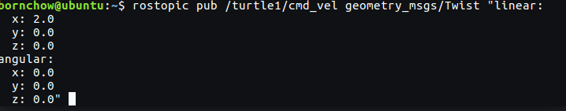

* 你可能已经注意到turtle已经停止移动了。这是因为turtle需要一个稳定的频率为1Hz的命令流来保持移动状态。我们可以使用rostopic pub -r命令来发布一个稳定的命令流
```
$ rostopic pub /turtle1/cmd_vel geometry_msgs/Twist -r 1 -- '[2.0, 0.0, 0.0]' '[0.0, 0.0, 1.8]'
```

* rostopic hz命令可以用来查看数据发布的频率

```
$ rostopic hz /turtle1/pose
```
```
rostopic type /turtle1/cmd_vel | rosmsg show
```

### 使用rqt_plot
使用rqt_plot命令来绘制正在发布到/turtle1/pose话题上的数据变化图形

-----

## ROS Services
服务（services）是节点之间通讯的另一种方式。服务允许节点发送请求（request） 并获得一个响应（response）
-- 同步**通讯机制**，传输请求/应答数据

rosservice可以很轻松的使用 ROS 客户端/服务器框架提供的服务。rosservice提供了很多可以在topic上使用的命令，如下所示

```
rosservice list         　　　　输出可用服务的信息
rosservice call         　　　　调用带参数的服务
rosservice type         　　　　输出服务类型
rosservice find         　　　　依据类型寻找服务find services by service type
rosservice uri          　　　　输出服务的ROSRPC uri
rosservice info　+service_name 查看某服务的详细信息
```

* 发布服务请求
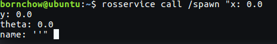

###  Using rosparam
rosparam使得我们能够存储并操作ROS 参数服务器（Parameter Server）上的数据。
参数服务器能够存储整型、浮点、布尔、字符串、字典和列表等数据类型。rosparam使用YAML标记语言的语法。一般而言，YAML的表述很自然：1 是整型, 1.0 是浮点型, one是字符串, true是布尔, [1, 2, 3]是整型列表, {a: b, c: d}是字典. rosparam有很多指令可以用来操作参数。

```
rosparam set            设置参数
rosparam get            获取参数
rosparam load           从文件读取参数
rosparam dump           向文件中写入参数
rosparam delete         删除参数
rosparam list           列出参数名
```

* 使用roaparam list 获取参数服务器上的参数：

```
rosparam set [param_name]
rosparam get [param_name]
```
* 修改背景颜色的红色通道

```
rosparam set background_r 150
```
* 调用清除服务使得修改后的参数生效

```
rosservice call clear
```
* 现在我们来查看参数服务器上的参数值——获取背景的绿色通道的值

```
rosparam get background_g
```
也可以使用`rosparam get /`来显示

* 使用rosparam dump and rosparam load，存储这些信息以备今后重新读取

```
rosparam dump [file_name]
rosparam load [file_name] [namespace]
```
现在我们将所有的参数写入params.yaml文件
```
rosparam dump params.yaml
```
你甚至可以将yaml文件重载入新的命名空间，比如说copy空间:
```
$ rosparam load params.yaml copy
$ rosparam get copy/background_b
```

------
## 使用rqt_console和roslaunch

### rqt_console 与 rqt_logger_level
rqt_console属于ROS日志框架(logging framework)的一部分，用来显示节点的输出信息。rqt_logger_level允许我们修改节点运行时输出信息的日志等级（logger levels）（包括 DEBUG、WARN、INFO和ERROR）

```
rosrun rqt_console rqt_console
```
```
rosrun rqt_logger_level rqt_logger_level
```

### 使用roslaunch

* 先切换到beginner_tutorials程序包目录下
```
$ roscd beginner_tutorials
```
* 然后创建一个launch文件夹

```
$ mkdir launch
$ cd launch
```

* 构建launch文件

```
   1 <launch>
   2 
   3   <group ns="turtlesim1">
   4     <node pkg="turtlesim" name="sim" type="turtlesim_node"/>
   5   </group>
   6 
   7   <group ns="turtlesim2">
   8     <node pkg="turtlesim" name="sim" type="turtlesim_node"/>
   9   </group>
      ### 在这里我们创建了两个节点分组并以'命名空间（namespace)'标签来区分，其中一个名为turtulesim1，另一个名为turtlesim2，两个组里面都使用相同的                        turtlesim节点并命名为'sim'。这样可以让我们同时启动两个turtlesim模拟器而不会产生命名冲突
  10 
  11   <node pkg="turtlesim" name="mimic" type="mimic">
  12     <remap from="input" to="turtlesim1/turtle1"/>
  13     <remap from="output" to="turtlesim2/turtle1"/>
  14   </node>
      ### 在这里我们启动模仿节点，并将所有话题的输入和输出分别重命名为turtlesim1和turtlesim2，这样就会使turtlesim2模仿turtlesim1
  15 
  16 </launch>
```

* 现在让我们通过roslaunch命令来启动launch文件


```
$ roslaunch beginner_tutorials turtlemimic.launch
```


-----

## 使用rosed编辑ROS中的文件

### rosed
rosed 是 rosbash 的一部分。利用它可以直接通过package名来获取到待编辑的文件而无需指定该文件的存储路径了。

```
$ rosed [package_name] [filename]
```

* rosed默认的编辑器是vim。如果想要将其他的编辑器设置成默认的，你需要修改你的 ~/.bashrc 文件，增加如下语句:

```
export EDITOR='emacs -nw'
```
-------

## 创建ROS 消息与ROS服务

* **消息(msg)**: msg文件就是一个描述ROS中所使用消息类型的简单文本。它们会被用来生成不同语言的源代码。

* **服务(srv)**: 一个srv文件描述一项服务。它包含两个部分：请求和响应。

msg文件存放在package的msg目录下，srv文件则存放在srv目录下。
msg文件实际上就是每行声明一个数据类型和变量名

```
int8, int16, int32, int64 (plus uint*)
float32, float64
string
time, duration
other msg files
variable-length array[] and fixed-length array[C]
```

### msg
在ROS中有一个特殊的数据类型：Header，它含有时间戳和坐标系信息。在msg文件的第一行经常可以看到Header header的声明.

下面是一个msg文件的样例，它使用了Header，string，和其他另外两个消息类型

```
 Header header
 string child_frame_id
 geometry_msgs/PoseWithCovariance pose
 geometry_msgs/TwistWithCovariance twist
```

### 自定义msg类型
在`beginner_tutorials`目录下
```
$ mkdir msg
$ echo "int64 num" > msg/Num.msg
```

* 接下来，还有关键的一步：我们要确保msg文件被转换成为C++，Python和其他语言的源代码
* 查看`package.xml`, 确保它包含一下两条语句

```
<build_depend>message_generation</build_depend>
<exec_depend>message_runtime</exec_depend>
```
如果没有，添加进去。 注意，在构建的时候，我们只需要"message_generation"。然而，在运行的时候，我们只需要"message_runtime"

* 在 `CMakeLists.txt`文件中，利用`find_packag`函数，增加对`message_generation`的依赖，这样就可以生成消息了。 你可以直接在COMPONENTS的列表里增加message_generation

```
# Do not just add this line to your CMakeLists.txt, modify the existing line
find_package(catkin REQUIRED COMPONENTS roscpp rospy std_msgs message_generation)
```
* 同样，你需要确保你设置了运行依赖
```
catkin_package(
  ...
  CATKIN_DEPENDS message_runtime ...
  ...)
```
修改以下代码块
```
# add_message_files(
#   FILES
#   Message1.msg
#   Message2.msg
# )
```
去掉注释符号#，用你的.msg文件替代Message*.msg
```
add_message_files(
  FILES
  Num.msg
)
```

 * 手动添加.msg文件后，我们要确保CMake知道在什么时候重新配置我们的project;
 确保添加了如下代码
```
 generate_messages()
```

```
generate_messages(
   DEPENDENCIES
   std_msgs
)
```

### 使用rosmsg

* 使用`rosmsg show`
```
$ rosmsg show [message type]
$ rosmsg show beginner_tutorials/Num
```
也可以使用
```
rosmsg show Num
```

### srv
创建srv
```
$ roscd beginner_tutorials
$ mkdir srv
```
这次我们不再手动创建服务，而是从其他的package中复制一个服务。 roscp是一个很实用的命令行工具，它实现了将文件从一个package复制到另外一个package的功能。
```
$ roscp [package_name] [file_to_copy_path] [copy_path]
$ roscp rospy_tutorials AddTwoInts.srv srv/AddTwoInts.srv
```

* 还有很关键的一步：我们要确保srv文件被转换成C++，Python和其他语言的源代码
现在认为，你已经如前边所介绍的，在CMakeLists.txt文件中增加了对message_generation的依赖
```
# Do not just add this line to your CMakeLists.txt, modify the existing line
find_package(catkin REQUIRED COMPONENTS
  roscpp
  rospy
  std_msgs
  message_generation
  )
```
(对的, message_generation 对msg和srv都起作用)
删掉#，去除对下边语句的注释:
```
# add_service_files(
#   FILES
#   Service1.srv
#   Service2.srv
# )
```
用你自己的srv文件名替换掉那些Service*.srv文件
```
add_service_files(
  FILES
  AddTwoInts.srv
)
```

### 使用rossrv
以上就是创建一个服务所需的所有步骤。下面通过rosmsg show命令，检查ROS是否能够识该服务
```
$ rossrv show <service type>
$ rossrv show beginner_tutorials/AddTwoInt

```

### msg和srv都需要的步骤
* 在CMakeLists.txt中找到如下部分
```
# generate_messages(
#   DEPENDENCIES
# #  std_msgs  # Or other packages containing msgs
# )
```
去掉注释并附加上所有你消息文件所依赖的那些含有.msg文件的package
```
generate_messages(
  DEPENDENCIES
  std_msgs
)
```
## 编写简单的消息发布器

### 编写发布器节点
* 在beginner_tutorials路径上创建src文件夹，这个文件夹将会用来放置 beginner_tutorials package 的所有源代码

在src里创建talker.cpp 
```cpp
#include "ros/ros.h"    // ros/ros.h 是一个实用的头文件，它引用了 ROS 系统中大部分常用的头文件
#include "std_msgs/String.h" // 这引用了 std_msgs/String 消息, 它存放在 std_msgs package 里，是由 String.msg 文件自动生成的头文件

#include <sstream>

/**
 * This tutorial demonstrates simple sending of messages over the ROS system.
 */
int main(int argc, char **argv)
{
  /**
   * The ros::init() function needs to see argc and argv so that it can perform
   * any ROS arguments and name remapping that were provided at the command line. For programmatic
   * remappings you can use a different version of init() which takes remappings
   * directly, but for most command-line programs, passing argc and argv is the easiest
   * way to do it.  The third argument to init() is the name of the node.
   *
   * You must call one of the versions of ros::init() before using any other
   * part of the ROS system.
   */
   // ROS节点初始化
  ros::init(argc, argv, "talker");  

  /**
   * NodeHandle is the main access point to communications with the ROS system.
   * The first NodeHandle constructed will fully initialize this node, and the last
   * NodeHandle destructed will close down the node.
   */
   // 创建句柄
  ros::NodeHandle n;

  /**
   * The advertise() function is how you tell ROS that you want to
   * publish on a given topic name. This invokes a call to the ROS
   * master node, which keeps a registry of who is publishing and who
   * is subscribing. After this advertise() call is made, the master
   * node will notify anyone who is trying to subscribe to this topic name,
   * and they will in turn negotiate a peer-to-peer connection with this
   * node.  advertise() returns a Publisher object which allows you to
   * publish messages on that topic through a call to publish().  Once
   * all copies of the returned Publisher object are destroyed, the topic
   * will be automatically unadvertised.
   *
   * The second parameter to advertise() is the size of the message queue
   * used for publishing messages.  If messages are published more quickly
   * than we can send them, the number here specifies how many messages to
   * buffer up before throwing some away.
   */
   // 创建一个 Publisher, 发布名称为chatter的topic，消息类型为std::msgs::String
  ros::Publisher chatter_pub = n.advertise<std_msgs::String>("chatter", 1000);
   //设置循环频率
  ros::Rate loop_rate(10);

  /**
   * A count of how many messages we have sent. This is used to create
   * a unique string for each message.
   */
  int count = 0;
  while (ros::ok())
  {
    /**
     * This is a message object. You stuff it with data, and then publish it.
     */
    //初始化std_msgs::String类型的消息
    std_msgs::String msg;

    std::stringstream ss;
    ss << "hello world " << count;
    msg.data = ss.str();

    ROS_INFO("%s", msg.data.c_str());

    /**
     * The publish() function is how you send messages. The parameter
     * is the message object. The type of this object must agree with the type
     * given as a template parameter to the advertise<>() call, as was done
     * in the constructor above.
     */
    //发布消息
    chatter_pub.publish(msg);
    //循环等待回调函数
    ros::spinOnce();
    //按照循环频率延时
    loop_rate.sleep();
    ++count;
  }


  return 0;
}
```
*  解析
```cpp
 ros::init(argc, argv, "talker");
```
**初始化 ROS**。它允许 ROS 通过命令行进行名称重映射——然而这并不是现在讨论的重点。在这里，我们也可以指定节点的名称——运行过程中，节点的名称必须唯一。
这里的名称必须是一个 base name ，也就是说，名称内不能包含 / 等符号。

```cpp
ros::NodeHandle n;

```
为这个进程的节点创建一个句柄。第一个创建的 NodeHandle 会为节点进行初始化，最后一个销毁的 NodeHandle 则会释放该节点所占用的所有资源

```
ros::Publisher chatter_pub = n.advertise<std_msgs::String>("chatter", 1000);
```
告诉 master 我们将要在 chatter（话题名） 上发布 std_msgs/String 消息类型的消息。这样 master 就会告诉所有订阅了 chatter 话题的节点，将要有数据发布
第二个参数是发布序列的大小。如果我们发布的消息的频率太高，缓冲区中的消息在大于 1000 个的时候就会开始丢弃先前发布的消息
NodeHandle::advertise() 返回一个 ros::Publisher 对象,它有两个作用： 
+ 它有一个 publish() 成员函数可以让你在topic上发布消息； 
+  如果消息类型不对,它会拒绝发布

```
ros::Rate loop_rate(10);
```
ros::Rate 对象可以允许你指定自循环的频率。它会追踪记录自上一次调用 Rate::sleep() 后时间的流逝，并休眠直到一个频率周期的时间
这里让它以 10Hz 的频率运行
```
int count = 0;
while (ros::ok())
{
```
roscpp 会默认生成一个 SIGINT 句柄，它负责处理 Ctrl-C 键盘操作——使得 ros::ok() 返回 false
如果下列条件之一发生，ros::ok() 返回false:
+ SIGINT 被触发 (Ctrl-C)
+ 被另一同名节点踢出 ROS 网络
+ ros::shutdown() 被程序的另一部分调用
+ 节点中的所有 ros::NodeHandles 都已经被销毁

```
std_msgs::String msg;
std::stringstream ss;
ss << "hello world " << count;
msg.data = ss.str();
```
我们使用一个由 msg file 文件产生的『消息自适应』类在 ROS 网络中广播消息。现在我们使用标准的String消息，它只有一个数据成员 "data"。当然，你也可以发布更复杂的消息类型
```
chatter_pub.publish(msg);
```
向所有订阅 chatter 话题的节点发送消息
```
ROS_INFO("%s", msg.data.c_str());
```
ROS_INFO 和其他类似的函数可以用来代替 printf/cout 等函数
```
ros::spinOnce();
```
在这个例子中并不是一定要调用 ros::spinOnce()，因为我们不接受回调。然而，如果你的程序里包含其他回调函数，最好在这里加上 ros::spinOnce()这一语句，否则你的回调函数就永远也不会被调用了
```
loop_rate.sleep();
```
这条语句是调用 ros::Rate 对象来休眠一段时间以使得发布频率为 10Hz

对上边的内容进行一下总结:
>初始化 ROS 系统
>在 ROS 网络内广播我们将要在 chatter 话题上发布 std_msgs/String 类型的消息
>以每秒 10 次的频率在 chatter 上发布消息

*  talker.py

```python
#! /urs/bin/env python
# licesen removed for brecity
import rospy
from std_msgs.msg import String


def talker():
	pub = rospy.Publisher('chatter', String, queue_sie=10)
	rospy.init_node('talker', anonymous=True)
	rate = rospy.Rate(10)
	while not rospy.is_shutdown():
		hello_str = "hello world %s" % rospy.get_time()
		rospy.loginfo(hello_str)
		pub.publish(hello_str)
		rate.sleep()


if __name__ == '__main__':
	try:
		talker()
	except rospy.ROSInterruptException:
		pass
```

### 编写订阅器节点

* 在beginner_tutorials package 目录下创建 src/listener.cpp 文件

```cpp
#include "ros/ros.h"
#include "std_msgs/String.h"

/**
 * This tutorial demonstrates simple receipt of messages over the ROS system.
 */
void chatterCallback(const std_msgs::String::ConstPtr& msg)
{
  ROS_INFO("I heard: [%s]", msg->data.c_str());
}

int main(int argc, char **argv)
{
  /**
   * The ros::init() function needs to see argc and argv so that it can perform
   * any ROS arguments and name remapping that were provided at the command line. For programmatic
   * remappings you can use a different version of init() which takes remappings
   * directly, but for most command-line programs, passing argc and argv is the easiest
   * way to do it.  The third argument to init() is the name of the node.
   *
   * You must call one of the versions of ros::init() before using any other
   * part of the ROS system.
   */
  ros::init(argc, argv, "listener");

  /**
   * NodeHandle is the main access point to communications with the ROS system.
   * The first NodeHandle constructed will fully initialize this node, and the last
   * NodeHandle destructed will close down the node.
   */
  ros::NodeHandle n;

  /**
   * The subscribe() call is how you tell ROS that you want to receive messages
   * on a given topic.  This invokes a call to the ROS
   * master node, which keeps a registry of who is publishing and who
   * is subscribing.  Messages are passed to a callback function, here
   * called chatterCallback.  subscribe() returns a Subscriber object that you
   * must hold on to until you want to unsubscribe.  When all copies of the Subscriber
   * object go out of scope, this callback will automatically be unsubscribed from
   * this topic.
   *
   * The second parameter to the subscribe() function is the size of the message
   * queue.  If messages are arriving faster than they are being processed, this
   * is the number of messages that will be buffered up before beginning to throw
   * away the oldest ones.
   */
  ros::Subscriber sub = n.subscribe("chatter", 1000, chatterCallback);

  /**
   * ros::spin() will enter a loop, pumping callbacks.  With this version, all
   * callbacks will be called from within this thread (the main one).  ros::spin()
   * will exit when Ctrl-C is pressed, or the node is shutdown by the master.
   */
  ros::spin();

  return 0;
}
```

```
void chatterCallback(const std_msgs::String::ConstPtr& msg)
{
  ROS_INFO("I heard: [%s]", msg->data.c_str());
}

```
这是一个回调函数，当接收到 chatter 话题的时候就会被调用。消息是以 boost shared_ptr 指针的形式传输，这就意味着你可以存储它而又不需要复制数据

```
ros::Subscriber sub = n.subscribe("chatter", 1000, chatterCallback);
```
* 告诉 master 我们要订阅 chatter 话题上的消息。当有消息发布到这个话题时，ROS 就会调用 chatterCallback() 函数。第二个参数是队列大小，以防我们处理消息的速度不够快，当缓存达到 1000 条消息后，再有新的消息到来就将开始丢弃先前接收的消息
* NodeHandle::subscribe() 返回 ros::Subscriber 对象,你必须让它处于活动状态直到你不再想订阅该消息。当这个对象销毁时，它将自动退订 chatter 话题的消息有各种不同的
* NodeHandle::subscribe() 函数，允许你指定类的成员函数，甚至是 Boost.Function 对象可以调用的任何数据类型

```
ros::spin();
```
ros::spin() 进入自循环，可以尽可能快的调用消息回调函数。如果没有消息到达，它不会占用很多 CPU，所以不用担心。一旦 ros::ok() 返回 false，ros::spin() 就会立刻跳出自循环。这有可能是 ros::shutdown() 被调用，或者是用户按下了 Ctrl-C，使得 master 告诉节点要终止运行。也有可能是节点被人为关闭的
下边，我们来总结一下:

>初始化ROS系统
>订阅 chatter 话题
>进入自循环，等待消息的到达
>当消息到达，调用 chatterCallback() 函数

*  listenet.py

```python
#!/usr/bin/env python
import rospy
from std_msgs.msg import String

def callback(data):
    rospy.loginfo(rospy.get_caller_id() + "I heard %s", data.data)
    
def listener():

    # In ROS, nodes are uniquely named. If two nodes with the same
    # name are launched, the previous one is kicked off. The
    # anonymous=True flag means that rospy will choose a unique
    # name for our 'listener' node so that multiple listeners can
    # run simultaneously.
    rospy.init_node('listener', anonymous=True)

    rospy.Subscriber("chatter", String, callback)

    # spin() simply keeps python from exiting until this node is stopped
    rospy.spin()

if __name__ == '__main__':
    listener()
```

### 编译节点
修改`beginner_tutorials`(**程序包**)下的`CMakeLists.txt`

```
cmake_minimum_required(VERSION 2.8.3)
project(beginner_tutorials)

## Find catkin and any catkin packages
find_package(catkin REQUIRED COMPONENTS roscpp rospy std_msgs genmsg)

## Declare ROS messages and services
add_message_files(DIRECTORY msg FILES Num.msg)
add_service_files(DIRECTORY srv FILES AddTwoInts.srv)

## Generate added messages and services
generate_messages(DEPENDENCIES std_msgs)

## Declare a catkin package
catkin_package()
```

修改为：
```
cmake_minimum_required(VERSION 2.8.3)
project(beginner_tutorials)

## Find catkin and any catkin packages
find_package(catkin REQUIRED COMPONENTS roscpp rospy std_msgs genmsg)

## Declare ROS messages and services
add_message_files(FILES Num.msg)
add_service_files(FILES AddTwoInts.srv)

## Generate added messages and services
generate_messages(DEPENDENCIES std_msgs)

## Declare a catkin package
catkin_package()
 
## Build talker and listener
include_directories(include ${catkin_INCLUDE_DIRS})

add_executable(talker src/talker.cpp)
target_link_libraries(talker ${catkin_LIBRARIES})
add_dependencies(talker beginner_tutorials_generate_messages_cpp)

add_executable(listener src/listener.cpp)
target_link_libraries(listener ${catkin_LIBRARIES})
add_dependencies(listener beginner_tutorials_generate_messages_cpp)
```
这会生成两个可执行文件, talker 和 listener, 默认存储到 devel space 目录下

+ 现在要为可执行文件添加对生成的消息文件的依赖

## 测试消息发布器与订阅器
+ 打开ros
```
roscore
```
+ source
```
# In your catkin workspace
$ cd ~/catkin_ws
$ source ./devel/setup.bash
```
+ 启动发布器
```
$ rosrun beginner_tutorials talker      (C++)
$ rosrun beginner_tutorials talker.py   (Python) 
```

+ 启动订阅器
```
$ rosrun beginner_tutorials listener     (C++)
$ rosrun beginner_tutorials listener.py  (Python) 
```

## 编写简单的服务器与客户端
### 自定义srv服务文件
查看`srv`

### 编写service节点
在`beginner_tutorials`包中创建`src/add_two_ints_server.cpp`

```cpp
#include "ros/ros.h"
#include "beginner_tutorials/AddTwoInts.h"

bool add(beginner_tutorials::AddTwoInts::Request  &req,
         beginner_tutorials::AddTwoInts::Response &res)
{
  res.sum = req.a + req.b;
  ROS_INFO("request: x=%ld, y=%ld", (long int)req.a, (long int)req.b);
  ROS_INFO("sending back response: [%ld]", (long int)res.sum);
  return true;
}

int main(int argc, char **argv)
{
  ros::init(argc, argv, "add_two_ints_server");
  ros::NodeHandle n;

  ros::ServiceServer service = n.advertiseService("add_two_ints", add);
  ROS_INFO("Ready to add two ints.");
  ros::spin();

  return 0;
}
```

* beginner_tutorials/AddTwoInts.h是由编译系统自动根据我们先前创建的srv文件生成的对应该srv文件的头文件
```
#include "ros/ros.h"
#include "beginner_tutorials/AddTwoInts.h"　
```

+ 这个函数提供两个int值求和的服务，int值从request里面获取，而返回数据装入response内，这些数据类型都定义在srv文件内部，函数返回一个boolean值

```
bool add(beginner_tutorials::AddTwoInts::Request  &req,
         beginner_tutorials::AddTwoInts::Response &res)
```

+ 现在，两个int值已经相加，并存入了response。然后一些关于request和response的信息被记录下来。最后，service完成计算后返回true值
```
{
  res.sum = req.a + req.b;
  ROS_INFO("request: x=%ld, y=%ld", (long int)req.a, (long int)req.b);
  ROS_INFO("sending back response: [%ld]", (long int)res.sum);
  return true;
}
```

+ 这里，service已经建立起来，并在ROS内发布出来
```
 ros::ServiceServer service = n.advertiseService("add_two_ints", add);
```

### 编写Client 节点

在`beginner_tutorials`包中创建  `src/add_two_ints_client.cpp`文件

```
#include "ros/ros.h"
#include "beginner_tutorials/AddTwoInts.h"
#include <cstdlib>

int main(int argc, char **argv)
{
  ros::init(argc, argv, "add_two_ints_client");
  if (argc != 3)
  {
    ROS_INFO("usage: add_two_ints_client X Y");
    return 1;
  }

  ros::NodeHandle n;
  ros::ServiceClient client = n.serviceClient<beginner_tutorials::AddTwoInts>("add_two_ints");
  beginner_tutorials::AddTwoInts srv;
  srv.request.a = atoll(argv[1]);
  srv.request.b = atoll(argv[2]);
  if (client.call(srv))
  {
    ROS_INFO("Sum: %ld", (long int)srv.response.sum);
  }
  else
  {
    ROS_ERROR("Failed to call service add_two_ints");
    return 1;
  }

  return 0;
}
```

+ 这段代码为add_two_ints service创建一个client。ros::ServiceClient 对象待会用来调用service
```
ros::ServiceClient client = n.serviceClient<beginner_tutorials::AddTwoInts>("add_two_ints");
```

+ 这里，我们实例化一个由ROS编译系统自动生成的service类，并给其request成员赋值。一个service类包含两个成员request和response。同时也包括两个类定义Request和Response。


```
  beginner_tutorials::AddTwoInts srv;
  srv.request.a = atoll(argv[1]);
  srv.request.b = atoll(argv[2]);
```

+ 这段代码是在调用service。由于service的调用是模态过程（**调用的时候占用进程阻止其他代码的执行**），一旦调用完成，将返回调用结果。如果service调用成功，call()函数将返回true，srv.response里面的值将是合法的值。如果调用失败，call()函数将返回false，srv.response里面的值将是非法的

```
  if (client.call(srv))
```

### 编译节点
再来编辑一下`beginner_tutorials`里面的`CMakeLists.txt`

1. 将下面的代码添加在文件`CMakeLists.txt`末尾

```
add_executable(add_two_ints_server src/add_two_ints_server.cpp)
target_link_libraries(add_two_ints_server ${catkin_LIBRARIES})
add_dependencies(add_two_ints_server beginner_tutorials_gencpp)

add_executable(add_two_ints_client src/add_two_ints_client.cpp)
target_link_libraries(add_two_ints_client ${catkin_LIBRARIES})
add_dependencies(add_two_ints_client beginner_tutorials_gencpp)
```

+ 这段代码将生成两个可执行程序"add_two_ints_server"和"add_two_ints_client"，这两个可执行程序默认被放在你的devel space下的包目录下，默认为~/catkin_ws/devel/lib/share/<package name>。你可以直接调用可执行程序，或者使用rosrun命令去调用它们。它们不会被装在<prefix>/bin目录下，因为当你在你的系统里安装这个包的时候，这样做会污染PATH变量。如果你希望在安装的时候你的可执行程序在PATH变量里面，你需要设置一下install target，请参考：catkin/CMakeLists.txt

2. 运行catkin_make命令

```
# In your catkin workspace
cd ~/catkin_ws
catkin_make
```

## 测试简单的Service 和Client

### 运行Service

```
$ rosrun beginner_tutorials add_two_ints_server     (C++)
$ rosrun beginner_tutorials add_two_ints_server.py  (Python)
```

### 运行Client

```
$ rosrun beginner_tutorials add_two_ints_client 1 3     (C++)
$ rosrun beginner_tutorials add_two_ints_client.py 1 3  (Python)
```

## 录制与回放数据

-----

```
rosbag record -a
rosbag info 
tosbag play
```


-----
### 录制数据(通过创建一个bag)

* 启动一个ros节点

```
roscore
rosrun turtlesim turtlesim_node
rosrun turtlesim turtle_teleop_key
```

使用`rostopic list -v`查看系统中发布的话题  


上面所发布话题部分列出的话题消息是唯一可以被录制保存到文件中的的话题消息，因为只有消息已经发布了才可以被录制。`/turtle1/com_vel`话题是`teleop_turtle`节点所发布的命令消息并作为`turtlesim`节点的输入。而`/turtle1/color_sensor`和`/turtle1/pose`是`turtlesim`节点发布出来的话题消息

* 构建用于录制的临时目录， 然后在该目录下运行`rosbag record`命令，并附加`-a`选项，该选项表示将当前发布的所有话题数据都录制保存到一个bag文件中

```
mkdir ~/bagfile
cd ~/bagfile
rosbag record -a
```

* 执行操作

* 结束录制

在运行`rosbag record`的窗口中按`ctrl-c`退出命令，`bagfile`中会出现一个以**年份、日期和时间**命名的`.bag`文件

### 检查回放bag文件

* 使用`rosbag info`来检查录制的`bag`文件

```
rosbag info <your bagfile>
```
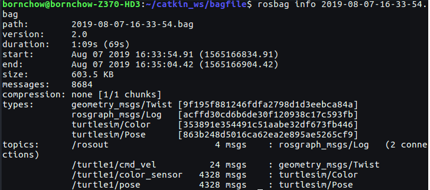

* 使用`rosbag play`回放
首先在turtle_teleop_key节点运行时所在的终端窗口中按Ctrl+C退出该节点。让turtlesim节点继续运行

```
rosbag play <your bagfile>
```

默认模式下，`rosbag play`命令在公告每条消息后会等待一小段时间（0.2秒）后才真正开始发布bag文件中的内容。等待一段时间的过程可以通知消息订阅器消息已经公告了消息数据可能会马上到来。如果`rosbag play`在公告消息后立即发布，订阅器可能会接收不到几条最先发布的消息。**等待时间可以通过`-d`选项来指定**

最终/turtle1/command_velocity话题将会被发布，同时在turtuelsim虚拟画面中turtle应该会像之前你通过turtle_teleop_key节点控制它一样开始移动。从运行rosbag play到turtle开始移动时所经历时间应该近似等于之前在本教程开始部分运行rosbag record后到开始按下键盘发出控制命令时所经历时间。你可以通过`-s`参数选项让rosbag play命令等待一段时间跳过bag文件初始部分后再真正开始回放。最后一个可能比较有趣的参数选项是`-r`选项，它允许你通过设定一个参数来改变消息发布速率。如果你执行：

```
rosbag play -r 2 <your bagfile>
```

### 录制数据子集

当运行一个复杂的系统时，比如PR2软件系统，会有几百个话题被发布，有些话题会发布大量数据（比如包含摄像头图像流的话题）。在这种系统中，要想把所有话题都录制保存到硬盘上的单个bag文件中是不切实际的。`rosbag record`命令支持只录制某些特别指定的话题到单个`bag`文件中，这样就允许用户只录制他们感兴趣的话题

* 重启turtlesim_node 与 turtle_teleop_key节点

```
rosrun turtlesim turtlesim_node
rosrun turtlesim turtle_teleop_key
```
* 在bagfile下执行

```
rosbag record -O subset /turtle1/command_velocity /turtle1/pose
rosbag record -O <bag_name> [topic_name1] [topic_name2]
```
 上述命令中的`-O`参数告诉`rosbag record`将数据记录保存到名为`subset.bag`的文件中，同时后面的话题参数告诉rosbag record只能录制这两个指定的话题


### 注意
在前述部分中你可能已经注意到了turtle的路径可能并没有完全地映射到原先通过键盘控制时产生的路径上——整体形状应该是差不多的，但没有完全一样。造成该问题的原因是turtlesim的移动路径对系统定时精度的变化非常敏感。rosbag受制于其本身的性能无法完全复制录制时的系统运行行为，rosplay也一样。对于像turtlesim这样的节点，当处理消息的过程中系统定时发生极小变化时也会使其行为发生微妙变化，用户不应该期望能够完美的模仿系统行为