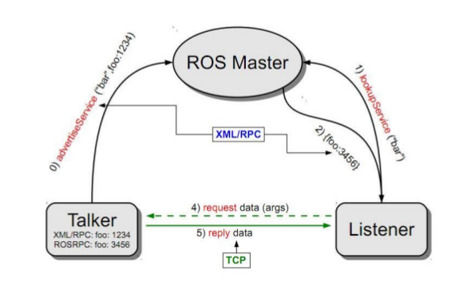
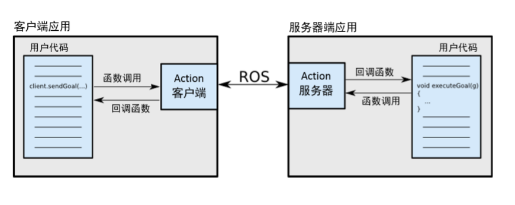
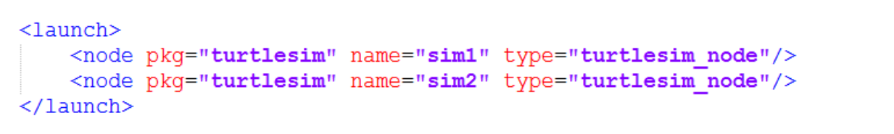

# ros 初步

## simulation

## update PX4

```
git submodule update --init --recursive
```

## ros 与opencv

```
$ catkin_create_pkg my_image_transport image_transport cv_bridge sensor_msgs
```

## 视觉

darknet_ros

[参考](https://blog.csdn.net/slzlincent/article/details/86607143)

[github](https://github.com/leggedrobotics/darknet_ros)

maskrcnn-bachmark

通用目标检测，区域提取
基于评分、基于分组合并


## ROS 参考资料

[古月居](http://www.huyuehome.com)

### 组件化工具包
* 3D可视化工具 -- rviz
* 物理仿真环境 -- gazebo
* 数据记录工具 -- rosbag
* Qt工具箱 -- rqt_*

### ros的安装目录

* /opt/ros

```
--bin 
--etc
--include(安装功能包的头文件)
--lib(功能包可执行文件)
--share()

```

# ROS通信

------
## 话题编程


## 服务编程

### 自定义srv文件

* 创建`srv`文件夹，创建`AddTwoInts.srv`文件，文件内容如下：

```
//请求数据 Request
int64 a
int64 b
---
//响应数据 Response
int64 sum
```

* 在`package.xml`中添加功能包

```
<build_depend>message_generation</build_depend>
<exec_depend>message_runtime</exec_depend>
```

* 在`CMakeLists.txt`中添加编译选项  

1. find_package
```
find_package( ...... message_generation)
```

2. catkin_package
```
catkin_package(CATKIN_DEPENDS geometry_msgs roscpp
rospy std_msgs message_runtime)
```

3. add_service_files
```
add_service_files(FILES AddTwoInts.srv)
```

4. generate_messages
```
generate_messages(
  DEPENDENCIES
  std_msgs
)
```

### 实现服务器server

```cpp
# include "ros/ros.h"
# include "learning_communication/AddTwoInts.h"

// service回调函数，输入参数req,　输出参数是res
bool add(learning_communication::AddTwoInts::Request &req,
         learning_communication::AddTwoInts::Response &res)
{
	res.sum = req.a + req.b;
	ROS_INFO("request: x=%ld, y=%ld", (long int)req.a, (long int)req.b);
	ROS_INFO("response: [%ld]", (long int)res.sum);
	
	return true;
}

int main(int argc, char **argv)
{
	//ROS节点初始化
	ros::init(argc, argv, "add_two_ints_server");
	
	// 创建句柄 n
	ros::NodeHandle n;

	//创建一个名为add_two_ints的server,注册回调函数为add()
	ros::ServiceServer service = n.advertiseService("add_two_ints", add);

	//循环等待回调函数
	ROS_INFO("ready to add two ints");
	ros::spin();

	return 0;
}
```

### 实现client

```cpp
# include <cstdlib>
# include "ros/ros.h"
# include "learning_communication/AddTwoInts.h"

int main(int argc, char **argv)
{
	//ROS节点初始化
	ros::init(argc, argv, "add_two_ints_client");

	//从终端获取两个加数
	if (argc != 3)
	{
		ROS_INFO("usage: add_two_ints_client X Y");
		return 1;
	}

	//创建句柄 n
	ros::NodeHandle n;
	
	//创建一个client,请求add_two_int serve, service 的消息类型是learning_communication::AddTwoInts
	ros::ServiceClient client = n.serviceClient<learning_communication::AddTwoInts>("add_two_ints");
	
	//创建learning_communication::AddTwoInts类型的service消息
	learning_communication::AddTwoInts srv;
	srv.request.a = atoll(argv[1]);
	srv.request.b = atoll(argv[2]);

	//发布service请求，等待加法运算结果
	if(client.call(srv)) //call()　命令是一个阻塞命令
	{
		ROS_INFO("SUM: %ld", (long int)srv.response.sum);
	}else{
		ROS_ERROR("Failed to call service add_two_ints");
		return 1;
	}

	return 0;
}
```

### 编译
* 在`CMakeLists.txt`中添加

```
add_executable(server src/server.cpp)
target_link_libraries(server ${catkin_LIBRARIES})
add_dependencies(server ${PROJECT_NAME}_gencpp)

add_executable(client src/client.cpp)
target_link_libraries(client ${catkin_LIBRARIES})
add_dependencies(client ${PROJECT_NAME}_gencpp)
```

## 动作编程

* 什么是动作
> * 一种问答通信机制
> * 带有连续反馈
> * 可以在任务过程中止运行
> * 基于ROS的消息机制实现



* 有及时反馈

### 自定义action文件

* 创建`action`文件夹，创建`DoDishes.action`文件，文件内容如下：

```
# define the goal 目标数据
uint32 dishwasher_id # Specify which dishwasher we want to use
---
# define the result 结果数据
uint32 total_dishes_cleaned

---
# define a feedback message 周期反馈数据
flaot32 percent_complete
```
* 在`package.xml`中添加功能包

```
<build_depend>actionlib</build_depend>
<build_depend>actionlib_msgs</build_depend>
<exec_depend>actionlib</exec_depend>
<exec_depend>actionlib_msgs</exec_depend>
```
* 在`CMakeLists.txt`中添加编译选项  

1. find_package()

```
find_package(catkin REQUIRED ... actionlib_msgs actionlib)
```
2. add_action_files()

```
add_action_files(DIRECTORY action FILES DoDishes.action)
```

3. catkin_package (可省略？)

```
catkin_package(
  CATKIN_DEPENDS roscpp std_msgs ... actionlib actionlib_msgs

)
```

4. generate_messages

```
generate_messages(DEPENDENCIES actionlib_msgs)
```


* bug

```
Could not find messages which
  '/home/flying/catkin_ws/src/xxxx' depends on.
  Did you forget to specify generate_messages(DEPENDENCIES ...)?
```

**解决**
查看自定义消息类型 ` xx.action` 中是否有语法错误

### 实现动作的服务器

```cpp
# include <ros/ros.h>
# include <actionlib/server/simple_action_server.h>
# include "learning_communication/DoDishesAction.h"

typedef actionlib::SimpleActionServer<learning_communication::DoDishesAction> Server;

// 收到action的goal后调用该回调函数
void execute(const learning_communication::DoDishesGoalConstPtr& goal, Server* as)
{
    ros::Rate r(1);
    learning_communication::DoDishesFeedback feedback;
    ROS_INFO("Dishwasher %d is working.", goal->dishwasher_id);

    // 假设洗盘子的进度，并按照1hz的频率发布进度feedback
    for(int i=1; i<=10; i++)
    {
        feedback.percent_complete = i * 10;
        as->publishFeedback(feedback);
        r.sleep();
    }

    // 当action完成后，向客户端返回结果
    ROS_INFO("Dishwasher %d is working.", goal->dishwasher_id);
    as->setSucceeded();
}

int main(int argc, char** argv)
{
    ros::init(argc, argv, "do_dishes_server");
    ros::NodeHandle n;

    //定义一个服务器
    Server server(n, "do_dishes", boost::bind(&execute, _1, &server), false);

    //服务器运行
    server.start();

    ros::spin();

    return 0;
}
```

### 实现动作客户端


```cpp
# include <ros/ros.h>
# include <actionlib/client/simple_action_client.h>
# include "learning_communication/DoDishesAction.h"

typedef actionlib::SimpleActionClient<learning_communication::DoDishesAction> Client;

//当action完成后调用该回调函数
void doneCb(const actionlib::SimpleClientGoalState& state,
            const learning_communication::DoDishesResultConstPtr& result)
{
    ROS_INFO("the dishes have done!!");
    ros::shutdown();
}

//当action激活后调用该回调函数
void activeCb()
{
    ROS_INFO("Goal just went active");
}

//当收到feedback后调用该回调函数
void feedbackCb(const learning_communication::DoDishesFeedbackConstPtr& feedback)
{
    ROS_INFO("percent_complete: %f", feedback->percent_complete);
}

int main(int argc, char** argv)
{
    ros::init(argc, argv, "do_dishes_client");

    //定义一个服务端
    Client client("do_dishes", true);

    //等待服务端
    ROS_INFO("Waiting for action server to start");
    client.waitForServer();
    ROS_INFO("Action server started, send goal");

    //创建一个action的goal
    learning_communication::DoDishesGoal goal;
    goal.dishwasher_id = 1;

    //发送action 的goal给服务器端，并设置回调函数
    client.sendGoal(goal, &doneCb, &activeCb, &feedbackCb);

    ros::spin();

    return 0;
}
```

### 动作编译


```
add_executable(DoDishes_client src/action_client.cpp)
target_link_libraries(DoDishes_client ${catkin_LIBRARIES})
add_dependencies(DoDishes_client ${${PROJECT_NAME}_EXPORTED_TARGETS})

add_executable(DoDishes_server src/action_server.cpp)
target_link_libraries(DoDishes_server ${catkin_LIBRARIES})
add_dependencies(DoDishes_server ${${PROJECT_NAME}_EXPORTED_TARGETS})
```

## ros 分布式通信!!!!!!!!!!!!


* ros 是一种`分布式`的软件框架，　`松耦合`

### 实现分布式多机ros通信

-----

1. 设置ip地址，确保底层链路联通


* 讲ip设置到`host`中，在`/etc/host`相互添加`ip` 和`name`
* 使用`ping + host_name`测试设置是否生效

2. 在从机端设置`ROS_MASTER_URL`，让从机
* 在`bashrc`中添加
```
export ROS_MASTER_URI=http://host_name:11311
```
其中`11311`是ros master的端口号

## ROS中的关键组件

### ROS launch文件

Launch 文件：通过`XML`文件实现多节点的配置与启动(可自动启动ROS master)



*  `<launch>` launch文件的根元素标签

*  `<node>` 启动节点

```
<node pkg="package_name" type="executable_name" name="node_name" />
```
> pkg ---节点所在的功能包的名称
> type ---节点的可执行文件
> name --- 节点运行时的名称， 该名字会覆盖代码中制定的节点名字
> output  respawn  required  ns  args

*  `<param>`设置ROS运行中的参数，储存在参数服务器中

```
<param name="" value="" />

# 加载参数文件中的多个参数
<rosparam file="" command="" ns="" />
```

* `<arg>`launch文件局部参数，只能在launch文件中使用

```
<arg name="arg_name" default="arg_value" />

# 调用
<parm name="" value="$(arg arg-name)" />
```

* `<remap>`重映射ROS 计算图资源的命名

```
<remap from="/turtlebot/cmd_vel" to="/cmd_vel" />
# from 原命名
# to 映射之后的命名
```

* `<include>`包含其他launch文件

```
<include file="$(dir)/other.launch">
```

### TF坐标变换

《机器人学导论》

* 广播tf变换


* 监听tf变换
```
rosrun tf view_frames
```
在运行命令的目录下生成　`frames.pdf`

* 查看坐标系之间的关系
```
rosrun tf tf_echo turtle1 turtle2
```

*  可视化工具

```
rosrun rviz rviz -d `rospack find turtle_tf` /rivz/turtle_rviz.rviz
```

#### 实现TF广播器!!!!!!!

* 定义TF广播器

```
TransformBoradcaster
```
* 创建坐标变换值
* 发布坐标变换

```
sendTransform
```
!!!!!!!!!!!!!!!!!!!!!!!!!!!!!!!!!!!!!!!!!!!!!!!!!!!!!!


#### 实现监听器

!!!!!!!!!!!!!!!!!!!!!!!!!!!!!!!!!!!!!!!!!!!!!!!!!!!!!!

#### 编译
* `CMakeLIsts.txt`配置

1. find_package

```
find_package(catkin REQUIRED COMPONENTS
  ...
  geometry_msgs
  tf
  turtlesim
)
```

* `package.xml`配置

```xml
  <build_depend>geometry_msgs</build_depend>
  <build_depend>tf</build_depend>
  <build_depend>turtlesim</build_depend>
  <build_export_depend>geometry_msgs</build_export_depend>
  <build_export_depend>tf</build_export_depend>
  <build_export_depend>turtlesim</build_export_depend>
  <exec_depend>geometry_msgs</exec_depend>
  <exec_depend>tf</exec_depend>
  <exec_depend>turtlesim</exec_depend>
```

* bug

```
[ERROR] [1565850569.293365471]: "turtle2" passed to lookupTransform argument target_frame does not exist. 
```

### QT工具箱


###  Rviz可视化平台

```
rosrun rviz rviz
```

### Gazebo物理仿真环境