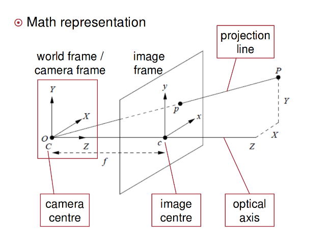

# RGBD_image

### RGB
RGB色彩模式是工业界的一种颜色标准，是通过对红(R)、绿(G)、蓝(B)三个颜色通道的变化以及它们相互之间的叠加来得到各式各样的颜色的，RGB即是代表红、绿、蓝三个通道的颜色，这个标准几乎包括了人类视力所能感知的所有颜色，是目前运用最广的颜色系统之一

### Depth Map

在3D计算机图形中，Depth Map（深度图）是包含与视点的场景对象的表面的距离有关的信息的图像或图像通道。其中，Depth Map 类似于灰度图像，只是它的每个像素值是传感器距离物体的实际距离。通常RGB图像和Depth图像是配准的，因而像素点之间具有一对一的对应关系

### 图像深度
图像深度 是指存储每个像素所用的位数，也用于量度图像的色彩分辨率
图像深度 确定彩色图像的每个像素可能有的颜色数，或者确定灰度图像的每个像素可能有的灰度级数。它决定了彩色图像中可出现的最多颜色数，或灰度图像中的最大灰度等级。比如一幅单色图像,若每个像素有8位，则最大灰度数目为2的8次方，即256。一幅彩色图像RGB三通道的像素位数分别为4,4,2，则最大颜色数目为2的4+4+2次方，即1024，就是说像素的深度为10位，每个像素可以是1024种颜色中的一种

[原文](https://blog.csdn.net/donkey_1993/article/details/80781773) 

------

### 从RGBD 图像到 point cloud

[参考](https://www.cnblogs.com/zb-ml/p/8884557.html)

$$

v=\frac{y \cdot f_{y}}{z}+c_{y}

$$