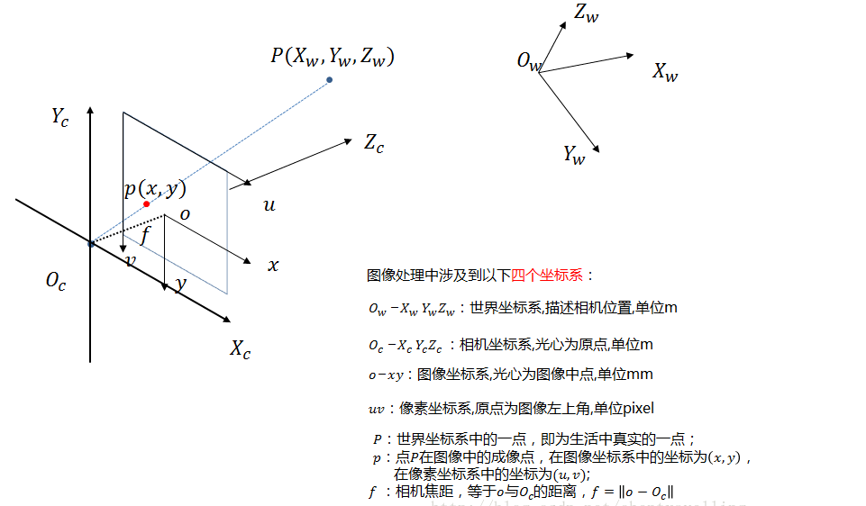
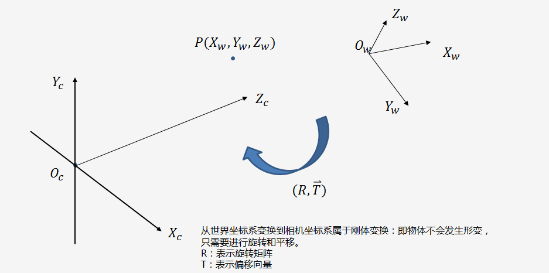
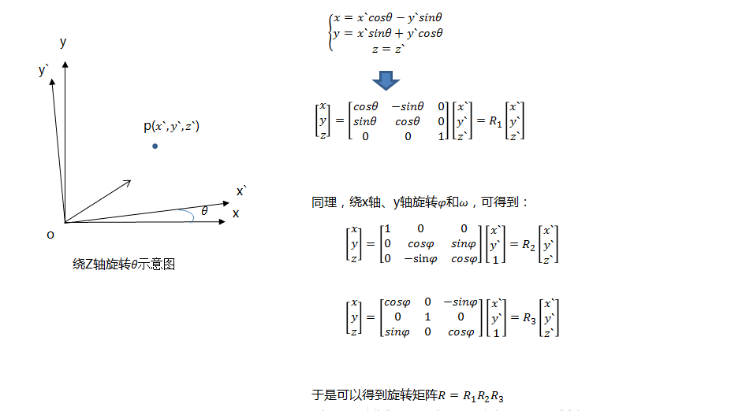

# 坐标系转换

[参考](https://blog.csdn.net/lyhbkz/article/details/82254069)

-------

图像处理、立体视觉等等方向常常涉及到四个坐标系：**世界坐标系**、**相机坐标系**、**图像坐标系**、**像素坐标系**

* 构建**世界坐标系**只是为了更好的描述相机的位置在哪里，在双目视觉中一般将**世界坐标系原点**定在**左相机**或者**右相机**或者**二者X轴方向的中点**

----------

## 世界坐标系与相机坐标系

* 绕着不同的坐标轴旋转不同的角度，得到相应的旋转矩阵，如下图所示：

